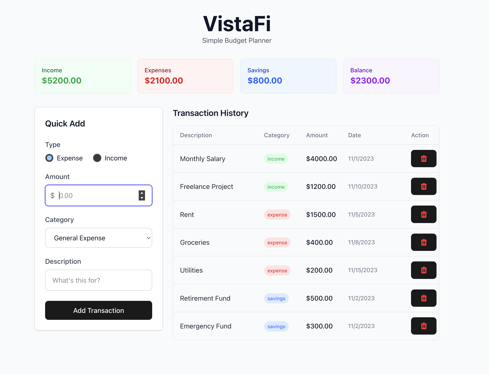

# VistaFi - Simple Budget Planner

A minimalist budget tracking application built with React, TypeScript, and Tailwind CSS v4. VistaFi helps you track income, expenses, and savings with a clean and intuitive interface.

## Features

- Dashboard with summary of income, expenses, savings, and balance
- Add transactions with quick categorization
- View transaction history with filtering options
- Delete transactions
- Responsive design for desktop and mobile

## Technologies Used

- React 19
- TypeScript
- Tailwind CSS v4
- Vite

## Screenshots



## Installation

1. Clone the repository:

   ```
   git clone https://github.com/yourusername/vistafi.git
   cd vistafi
   ```

2. Install dependencies:
   ```
   npm install
   ```

## Usage

### Development Server

Run the development server:

```
npm run dev
```

This starts the app in development mode. Open [http://localhost:3000](http://localhost:3000) to view it in your browser.

### Building for Production

Build the app for production:

```
npm run build
```

Preview the production build:

```
npm run preview
```

## Project Structure

```
vistafi/
├── src/                    # Source files
│   ├── components/         # React components
│   │   ├── BudgetForm.tsx  # Form for adding new transactions
│   │   ├── BudgetItemList.tsx # List of budget transactions
│   │   └── BudgetSummary.tsx # Summary of budget statistics
│   ├── data/               # Mock data
│   ├── types/              # TypeScript type definitions
│   ├── utils/              # Utility functions
│   ├── App.tsx             # Main App component
│   └── main.tsx            # Entry point
├── public/                 # Static assets
└── index.html              # HTML template
```

## Development Notes

This project was created with Vite and uses React with TypeScript. The ESLint configuration can be expanded for production applications:

```js
// eslint.config.js example for production
export default tseslint.config({
  extends: [
    ...tseslint.configs.recommendedTypeChecked,
    ...tseslint.configs.strictTypeChecked,
  ],
  languageOptions: {
    parserOptions: {
      project: ["./tsconfig.node.json", "./tsconfig.app.json"],
      tsconfigRootDir: import.meta.dirname,
    },
  },
});
```

## License

MIT
