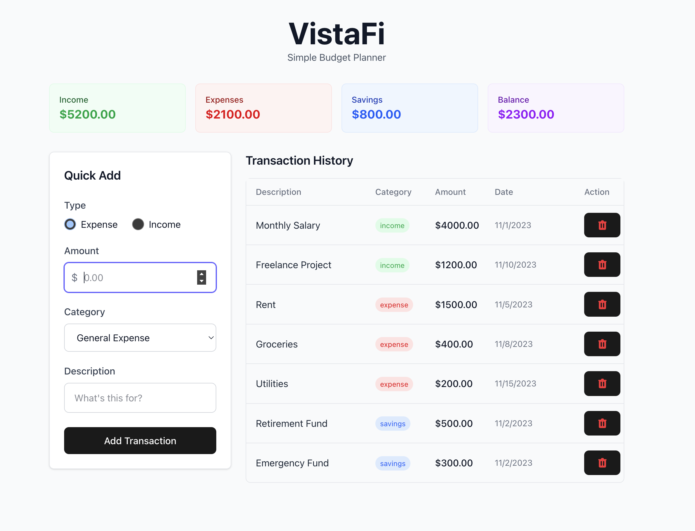

# VistaFi - Simple Budget Planner

A minimalist budget tracking application built with React, TypeScript, and Tailwind CSS v4. VistaFi helps you track income, expenses, and savings with a clean and intuitive interface.

## Features

- Dashboard with summary of income, expenses, savings, and balance
- Add transactions with quick categorization
- Edit and delete transactions with confirmation
- Filter by category and search by description
- Persistent storage via localStorage
- Responsive design for desktop and mobile

## Technologies Used

- React 19
- TypeScript
- Tailwind CSS v4
- Vite

## Screenshots



## Installation

1. Clone the repository:

   ```
   git clone https://github.com/adrayandaleandrew/vistafi.git
   cd vistafi
   ```

2. Install dependencies:
   ```
   npm install
   ```

## Usage

### Development Server

Run the development server:

```
npm run dev
```

This starts the app in development mode. Open [http://localhost:5173](http://localhost:5173) to view it in your browser.

### Building for Production

Build the app for production:

```
npm run build
```

Preview the production build:

```
npm run preview
```

### Running Tests

```
npm run test:unit      # Unit + integration tests (Vitest)
npm run test:e2e       # E2E tests (Playwright) — requires build first
```

## Project Structure

```
vistafi/
├── src/
│   ├── components/
│   │   ├── BudgetForm.tsx       # Add transaction form (segmented type control + toast)
│   │   ├── BudgetItemList.tsx   # Transaction list (hover-reveal edit + two-step delete)
│   │   ├── BudgetSummary.tsx    # Bento grid: balance hero + 3 metrics
│   │   ├── FilterBar.tsx        # Category filter pills + text search
│   │   └── EditModal.tsx        # Edit transaction modal (ESC/backdrop dismiss, focus trap)
│   ├── hooks/
│   │   └── useBudget.ts         # All budget state + handlers
│   ├── App.tsx                  # Root component
│   └── main.tsx                 # Entry point
├── shared/
│   ├── types/budget.ts          # BudgetItem, BudgetSummary, BudgetCategory
│   ├── utils/budgetUtils.ts     # calculateBudgetSummary(), generateId()
│   └── data/mockData.ts         # Seed data (7 items)
├── tests/
│   ├── unit/
│   │   ├── budgetUtils.test.ts  # 14 utility unit tests
│   │   └── components/          # Component unit tests
│   ├── integration/
│   │   └── budgetFlows.test.tsx # Integration tests (full App)
│   ├── e2e/
│   │   └── app.spec.ts          # Playwright E2E tests
│   └── setup.ts                 # jest-dom matchers + cleanup
├── public/                      # Static assets
└── index.html                   # HTML template
```

## License

MIT
